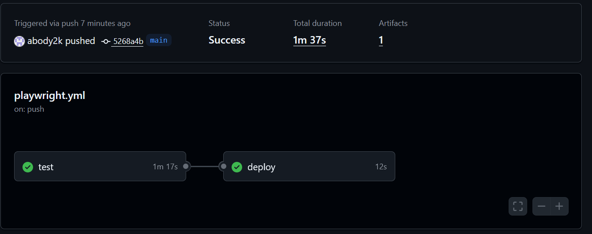
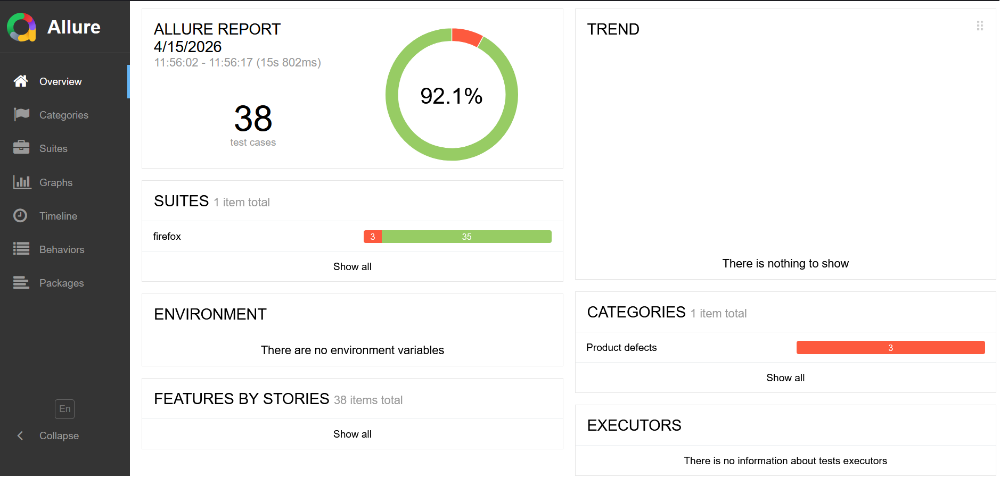
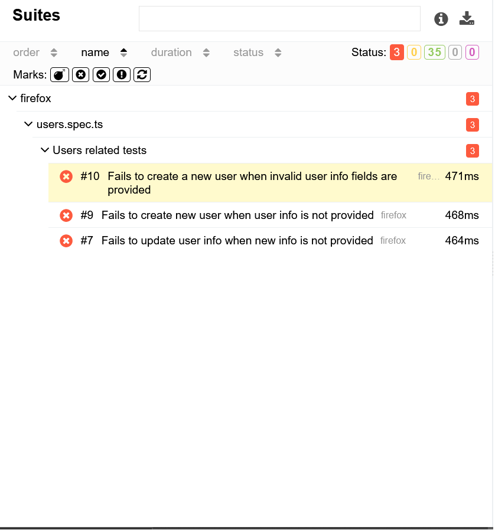
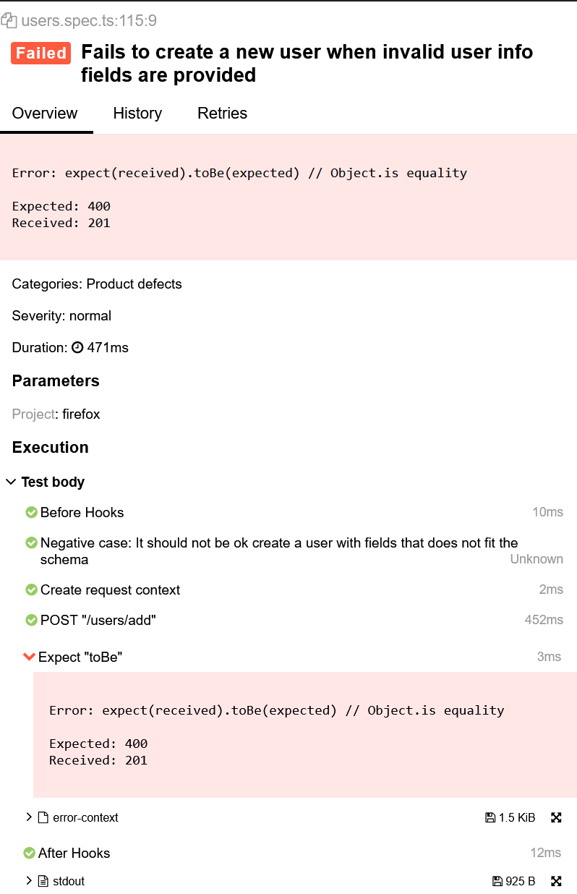

# API Automation Framework

[](https://github.com/abody2k/API-Automation-Framework/actions/workflows/playwright.yml)

---

## Overview

This project is an API automation testing framework designed to validate REST APIs with a focus on:

- scalable test structure
- reusable components
- strong coverage of positive, negative, and edge cases
- maintainability as test volume grows

The framework is built to simulate real-world API testing scenarios with clean architecture and reporting support.

---

## Architecture Overview

The project follows a modular and scalable structure:


- api/ → API client layer (request abstraction)

- tests/ → test suites organized by feature

- utils/ → reusable utilities (logging, helpers)

- schemas/ → response validation (Zod schemas)

- data/ → test data generators and fixtures

- flows/ → multi-step business flows (end-to-end API flows)

- assertions/ → reusable assertion logic


This separation ensures:
- high maintainability
- easy scalability
- clear responsibility boundaries

---

## CI Pipeline

The project uses GitHub Actions for continuous integration.



---

## Reporting

### Allure Report
Test execution results are visualized using Allure reporting.



---

## Failure Visibility & Debugging

Failed test executions are captured with full context for debugging.

### Example Failure Overview


### Detailed Failure Report


This includes:
- request details
- response payload
- error messages
- execution traces

---

## Key Features

- API testing using a structured framework approach
- Modular API client abstraction
- Reusable assertions and utilities
- Schema validation using Zod
- Support for positive, negative, and edge case testing
- Multi-step API flows (end-to-end scenarios)
- CI integration with GitHub Actions
- Allure reporting for test visualization
- Independent and isolated test design

---

## How to Run Tests

```bash
npm install
npx playwright test